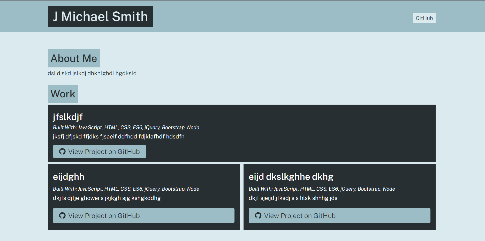

# GitHub Portfolio Generator

## Purpose
To allow the user to generate a GitHub portfolio from their terminal.

## Built With
* CSS
* JavaScript
* Node.js
* inquirer npm

## Deployment
Because this app runs in a terminal, the code must be cloned to be run.

## Preview
